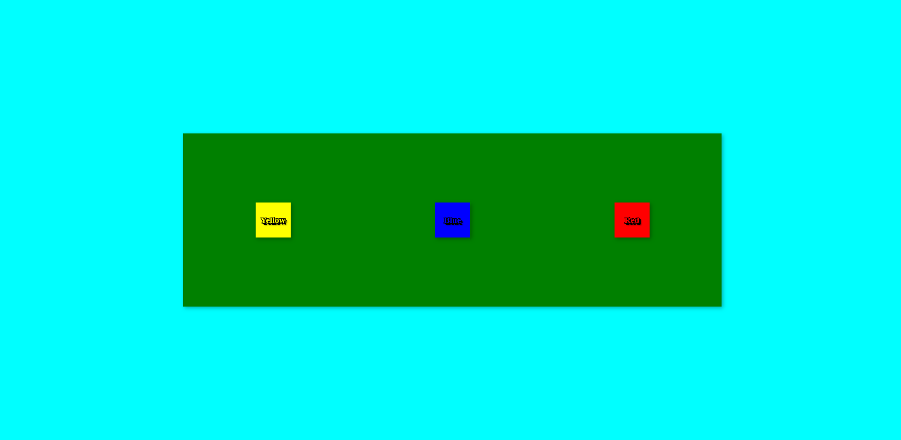

# Webdev Test

Can you center a div?

## Demo

### Screenshot

### Video

## Features
Recreate the screenshot and video above.

Specific colors and sizing is not important, but attempt to match the overall look.

When the boxes are clicked, they should change colors and the color name should change with it.

## Getting Started

Extensions: 
1. Live Server by Ritwick Dey

Helpful Links:
1. https://css-tricks.com/snippets/css/a-guide-to-flexbox/
2. https://developer.mozilla.org/en-US/docs/Web/API/EventTarget/addEventListener

## Notes

You should not need additional libraries or frameworks.
You should be able to complete the test using only HTML, CSS, and JavaScript.
You should not need additional files.

